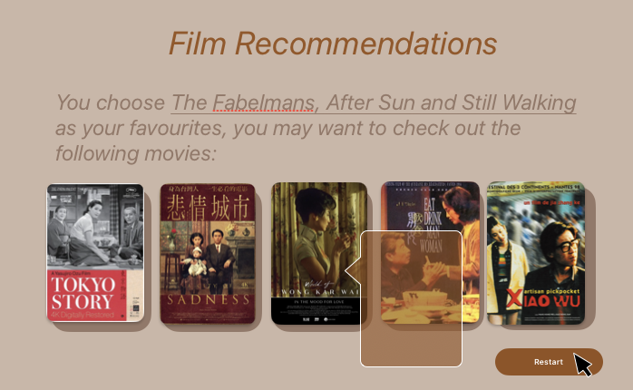

# 🎥 filmTO 🎞️

## Overview

> Q: What is your app? Brief description in a couple of sentences.

`filmTO` is an _interactive_ online guide for film enthusiasts 🎦. This app _highlights_ Toronto's independent art cinemas with rich history, _recommends_ multicultural film festivals, and _suggests_ popular movies based on users' viewing habits.

### Problem

> Q: Why is your app needed? Background information around any pain points or other reasons.

Toronto welcomes many newcomers, including students and immigrants, each year. As one of them, I understand how eager these individuals are to participate in local activities, explore different cultures, and make new friends.

As a film enthusiast, I noticed Toronto has many film-related events, but they are often hard to find. People miss out on free summer park movie festivals, TIFF under 25 free memberships, and other events because information is poorly presented online. Google searches for film festivals or art cinemas in Toronto often yield disappointing results.

The pandemic has further impacted independent cinemas, with many struggling to stay open. For example, Revue Cinema nearly closed last month.

`filmTO` aims to bridge this gap by connecting film enthusiasts with exciting events. It will aggregate information about film-related activities and venues, helping art house cinemas and film festivals find their audiences, also ensuring viewers never miss events they're interested in.

### User Profile

> Q: Who will use your app? How will they use it? Any special considerations that your app must take into account.

- Film Enthusiasts in Toronto:
  - Individuals who seek more than just commercial films at Cineplex.
  - Passionate about attending multicultural film festivals.
  - Actively support art and independent cinemas.
  - Eager to connect with fellow film lovers and share their viewing experiences.

### Features

> Q: List the functionality that your app will include. These can be written as user stories or descriptions with related details. Do not describe _how_ these features are implemented, only _what_ needs to be implemented.

- As a user, I want to be able to **find the closest art house cinema** near my current or any given location.

- As a user, I want to know which **film festivals** are currently happening.

- As a user, I want to know which film festivals are happening each month.

- As a user, I want to add interesting film festival events to my calendar.

- As a user, I want to see the **latest news** about the cinemas and film festivals.

- As a user, I want to be able to create an account and log in to manage my **liked** film festivals, cinemas and articles.

- As a logged-in user, I want to be able to **like(save)** or unlike a visited cinemas, film festivals or articles.

- As a logged-in user, I want to be able to **comment** on a visited cinemas, film festivals or articles.

- As a logged-in user, I want to be able to **delete my comment** on a visited cinemas, film festivals or articles.

- As a logged-in user, I want to **search** for popular films.

## Implementation

### Tech Stack

> Q: List technologies that will be used in your app, including any libraries to save time or provide more functionality. Be sure to research any potential limitations.

#### Main Stack

`filmTO` is a web app built in [Next.js](https://nextjs.org/docs):

- Client:
  - React with TypeScript (for functionalities)
  - [NextUI](https://nextui.org/docs/guide/introduction) with [TailwindCSS](https://tailwindcss.com/docs/installation) (for styles)
  - [Zustand](https://docs.pmnd.rs/zustand/getting-started/introduction) (for state management)
  - [react-query](https://tanstack.com/query/latest/docs/framework/react/overview) (for API fetching)

---

- Server:
  - Node with TypeScript (for server-side code)
  - MySQL with [Drizzle](https://orm.drizzle.team/docs/get-started-mysql) (for database and ORM)
  - [LangChain](https://js.langchain.com/v0.1/docs/guides/deployment/nextjs/) (for fetching LLMs)

### APIs

List any external sources of data that will be used in your app.

- [Google Maps API](https://developers.google.com/maps) for the cinema map
- [Google Calendar API](https://developers.google.com/calendar/api/guides/overview) for add film events to user's calendar
- [TMDB API](https://www.themoviedb.org/) for display movies
- [OpenAI API](https://platform.openai.com/docs/overview) for search the popular films

### Sitemap

List the pages of your app with brief descriptions. You can show this visually, or write it out.

- Home page
  - Cinema map
    - View + comment a Cinema + like(save)
  - Film festival calendar
    - View + comment a Festival + like(save) + add to calendar
  - Film recommendations
    - search with favorite movies
  - Film articles
- Authentication
  - Register page
  - Login page
- User
  - Account dashboard page

### Mockups

Provide visuals of your app's screens. You can use tools like Figma or pictures of hand-drawn sketches.

#### Home Page


#### Cinema Map


#### Film Festival Calendar


#### Film Recommendations




#### Film Event Articles


#### Register Page


#### Login Page


#### Account Dashboard Page


### Data

Describe your data and the relationships between them. You can show this visually using diagrams, or write it out.

- Cinema

  - id (int -- prmiry key)
  - name (varchar)
  - address (varchar)
  - description (text)
  - website (varchar)
  - longitude (decimal)
  - latitude (decimal)
  - image
  - likes (int)

- Festival

  - id (int -- primary key)
  - name (varchar)
  - date (varchar)
  - location (varchar)
  - description (text)
  - website (varchar)
  - image
  - likes (int)

- Comment

  - id (int -- primary key)
  - festivalId (int -- foreign key)
  - cinemaId (int -- foreign key)
  - articleId (int -- foreign key)
  - userId (int -- foreign key)
  - content (text)
  - likes (int)

- Like

  - id (int -- primary key)
  - festivalId (int -- foreign key)
  - cinemaId (int -- foreign key)
  - articleId (int -- foreign key)
  - userId (int -- foreign key)

- User

  - user_id (int -- primary key)
  - user_name (varchar)
  - user_email (varchar)
  - user_password (varchar/int)

- Article

  - id(int -- primary key)
  - url (varchar)
  - article's content will be saved in backend's public storage

### Endpoints

List endpoints that your server will implement, including HTTP methods, parameters, and example responses.

**GET / cinemas**

- Get cinemas

Parameters (Optional):

- longitude: User-provided location as a number
- latitude: User-provided location as a number

Response:

```json
[
    {
        "id": uuid(),
        "name": "TIFF Lightbox",
        "address": "350 King St W, Toronto, ON M5V 3X5",
        "website": "tiff.net",
        "longitude":""
        "latitude":"",
        "image":"url",
        "likes":2,
        "comment":{[...]}
    },
    ...
]
```

**GET / festivals**

- Get festivals

Response:

```json
[
  {
    "id": uuid(),
    "name": "Toronto International Film Festival",
    "date": "Sep 5 - 15, 2024",
    "location":"TIFF Lightbox",
    "website": "tiff.net",
    "image":"url",
    "likes":2,
    "comment":{[...]}
  },
  ...
]
```

**GET /comments**
**GET /comments/:commentable/:commentableId**

- Get comments by commentableId

Parameters:

- commentable: one of 'cinema', 'article', 'festival'
- commentableId: id of the commentable entity

Response:

```json
[
    {
        "id": uuid(),
        "commentableId":uuid(),
        "commentableType":"cinema/article/festival",
        "user_id":uuid(),
        "likes":2,
        "comments":[{...}]
    },
    ...
]
```

**GET /users**
**GET /users/:userId**

- Get all users or a specific user.
- Logged in user can make like(save) cinemas/festivals/articles

Parameters:

- userId: user's id

Response:

```json
[
    {
        "user_id": uuid(),
        "user_name": "Jennifer",
        "user_email":"Jennifer.2015@gmail.com",
        "user_password":"ASf_3soi*2sad]]a[sfp,fn]",
        "liked": {
            "cinemas": [{...}],
            "articles": [{...}],
            "festivals": [{...}],
        }
    },
    ...
]
```

**GET /articles**

- Get all articles

Response:

```json
[
    {
        "id": uuid(),
        "url": "url"
        "content": "..."
    },
    ...
]
```

**POST /comment/:commentableType**

- post a comment

Body:

- userId
- comment: content of the comment

Parameters:

- commentableType: one of 'cinema', 'article', 'festival'

Response:

```json
[
    {
        "id": uuid(),
        "commentableType":"cinema/article/festival",
        "user_name": "Jennifer",
        "likes":2,
        "content": "..."
    }
]
```

**PUT /like/:commentableType/:commentableId**

- put like

Parameters:

- commentableType
- commentableId

Response:

```json
{
    "id": uuid(),
    “likes”: 5,
}
```

**DELETE comment/:commentableType/:commentableId/**

- delete user's own comment

Body:

- userId

Parameters:

- commentableType
- commentableId

Response:

```json
[
    {
        "id": uuid(),
        "user_id":uuid(),
        "commentableType":"cinema/article/festival",
        "likes":2,
    }
]
```

**POST /users/register**

- Add a user account

Body:

- email: User's email
- password: User's provided password

Response:

```json
{
  "token": "seyJhbGciOiJIUzI1NiIsInR5cCI6IkpXVCJ9.eyJzdWIiOiIxMjM0NTY3ODkwIiwibmFtZSI6I..."
}
```

**Post /users/login**

- Login a user

Body:

- email: User's email
- password: User's provided password

Response:

```json
{
  "token": "seyJhbGciOiJIUzI1NiIsInR5cCI6IkpXVCJ9.eyJzdWIiOiIxMjM0NTY3ODkwIiwibmFtZSI6I..."
}
```

### Auth (Optional)

Does your project include any login or user profile functionality? If so, describe how authentication/authorization will be implemented.

- JWT auth
  - Before adding auth, all API requests will be using a fake user with id 1
  - Added after core features have first been implemented
  - Store JWT in localStorage, remove when a user logs out
  - Add states for logged in showing different UI in places listed in mockups

## Roadmap

Scope your project as a sprint. Break down the tasks that will need to be completed and map out time frames for implementation. Think about what you can reasonably complete before the due date. The more detail you provide, the easier it will be to build.

(Aug 4 Sun - Aug 5 Mon 2-DAYS) - sprint 1

- Create client

  - Next.js and react project with routes and boilerplate pages

- Create server - Create client

  - Next.js project with routing, with placeholder 200 responses

- Set Database & Create Seed

- Gather 10 cinema and 30 festivals in Toronto

- Create seeds with sample data

- Front-end: Home page / Nav / Hero

- Front-end: Register Page / Login Page / Account Dashboard Page

(Aug 6 Tue - Aug 11 Sun 6 DAYS) - sprint 2

- Front-end: Cinema map / Film Festival Calendar / Film Recommendations / Film Event Articles

- Feature: List cinemas from a given location

  - Implement list cinemas page including location form
  - Store given location in sessionStorage (optional)
  - Use Google API
  - Create GET /cinemas endpoint

- Feature: View festivals

  - Implement view festivals page
  - Create GET /festivals endpoint

- Feature: View articles

  - Implement view festivals page
  - Create GET /articles endpoint

- Feature: put likes

  - Add & update likes to festival/cinema/article page
  - Create PUT /likes

- Feature: search film recommendations
  - get film recommendations from OpenAI

(Aug 12 Mon - Aug 15 Thu 4 DAYS) - sprint 3

- Feature: Create account

  - Implement register page + form
  - Create POST /users/register endpoint

- Feature: Login

  - Implement login page + form
  - Create POST /users/login endpoint

- Feature: Implement JWT tokens

  - Server: Update expected requests / responses on protected endpoints
  - Client: Store JWT in local storage, include JWT on axios calls

- Feature: post comments

  - Add form input to view festival/cinema/article page
  - Create POST /comments

- Feature: delete comments

  - delete comment festival/cinema/article page
  - Create DELETE /comments

- Deploy client and server projects so all commits will be reflected in production

(Aug 16 Fri) - DEMO DAY

(Aug 16 Fri - Aug 19 11:59 PM Mon 4 DAYS) - sprint 4

- Optional features
- Bug fixes
- Testing

(Aug 19 Fri 11:59 Mon PM ) - Final submission DAY

## Nice-to-haves

Your project will be marked based on what you committed to in the above document. Under nice-to-haves, you can list any additional features you may complete if you have extra time, or after finishing.

Does your project include any login or user profile functionality?
If so, describe how authentication/authorization will be implemented.

- Change website color themes based on movie color palette (default theme, star war theme for dark mode and The Grand Budapest Hotel theme)
- Show article views
- Show more theatres, DVD-store, music and books stores in cinema map
- Recommend more film related contents (e.g. video essays, film critiques)
- Show which stream service can watch it
- Forgot password functionality
- Unit and Integration Tests
