# 🎥 filmTO 🎞️

## Overview

`filmTO` is an _interactive_ online guide for film enthusiasts 🎦. This app _highlights_ Toronto's independent art cinemas with rich history, _recommends_ multicultural film festivals, and _suggests_ popular movies based on users' interests.

## How to start

1. Install dependencies

```bash
npm i
```

2. Populate env variables

```bash
cp .env.example .env.local

# update .env.local accordingly
```

3. Initialize database

Run PostgreSQL server locally:

```bash
docker compose up -d

# to stop the database and clean volumes
docker compose down -v
```

Run database migrations and seedings:

```bash
npm run db:generate
npm run db:migrate
npm run db:seed
```

4. Start the project

```bash
npm run build
npm run start

# to run in watch mode (which will impact the overall performance)
npm run dev
```

## Proposal

### Problem

Toronto welcomes many newcomers, including students and immigrants, each year. As one of them, I understand how eager these individuals are to participate in local activities, explore different cultures, and make new friends.

As a film enthusiast, I noticed Toronto has many film-related events, but they are often hard to find. People miss out on free summer park movie festivals, TIFF under 25 free memberships, and other events because information is poorly presented online. Google searches for film festivals or art cinemas in Toronto often yield disappointing results.

The pandemic has further impacted independent cinemas, with many struggling to stay open. For example, Revue Cinema nearly closed last month.

`filmTO` aims to bridge this gap by connecting film enthusiasts with exciting events. It will aggregate information about film-related activities and venues, helping art house cinemas and film festivals find their audiences, also ensuring viewers never miss events they're interested in.

### User Profile

- Film Enthusiasts in Toronto:
  - Individuals who seek more than just commercial films at Cineplex.
  - Passionate about attending multicultural film festivals.
  - Actively support art and independent cinemas.
  - Eager to connect with fellow film lovers and share their viewing experiences.

### Features

- As a user, I want to be able to **find the closest art house cinema** near my current or any given location.

- As a user, I want to know which **film festivals** are currently happening.

- As a user, I want to know which film festivals are happening each month.

- As a user, I want to see the **latest news** about the cinemas and film festivals.

- As a user, I want to be able to create an account and log in to manage my **liked** film festivals, cinemas and articles.

- As a logged-in user, I want to be able to **like(save)** or unlike a visited cinemas, film festivals or articles.

- As a logged-in user, I want to **get** film suggestions based on my interests.

## Implementation

### Tech Stack

#### Main Stack

`filmTO` is a web app built in [Next.js](https://nextjs.org/docs):

- Client:
  - React with TypeScript (for functionalities)
  - [NextUI](https://nextui.org/docs/guide/introduction) with [TailwindCSS](https://tailwindcss.com/docs/installation) (for styles)

---

- Server:
  - Node with TypeScript (for server-side code)
  - MySQL with [Drizzle](https://orm.drizzle.team/docs/get-started-mysql) (for database and ORM)
  - [LangChain](https://js.langchain.com/v0.1/docs/guides/deployment/nextjs/) (for fetching LLMs)

### APIs

- [Google Maps API](https://developers.google.com/maps) for the cinema map
- [Google Gemini API](https://platform.openai.com/docs/overview) for search the popular films
- [TMDB API](https://www.themoviedb.org/) for display movies

### Sitemap

- Home page
  - Cinema map
    - View + comment a Cinema + like(save)
  - Film festival calendar
    - View + comment a Festival + like(save) + add to calendar
  - Film recommendations
    - search with favorite movies
  - Film articles
- Authentication
  - Register page
  - Login page
- User
  - Account dashboard page

### Mockups

#### Home Page

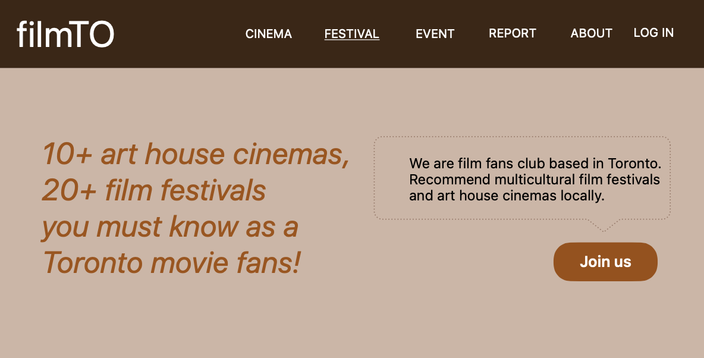

#### Cinema Map

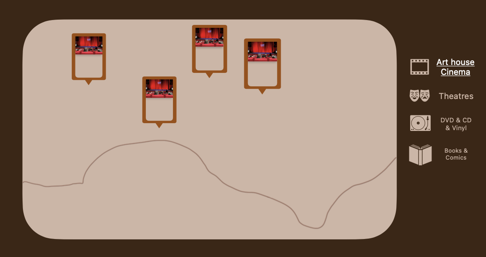

#### Film Festival Calendar

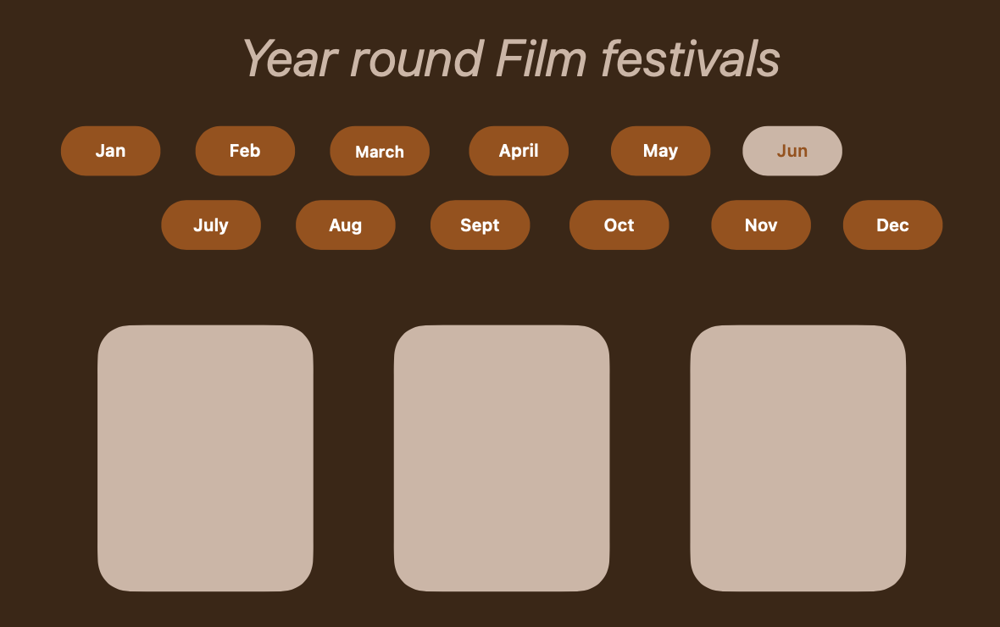

#### Film Recommendations

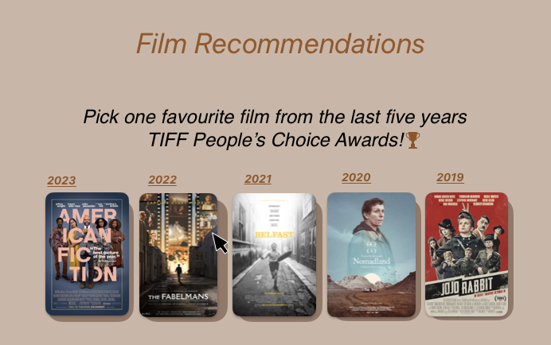
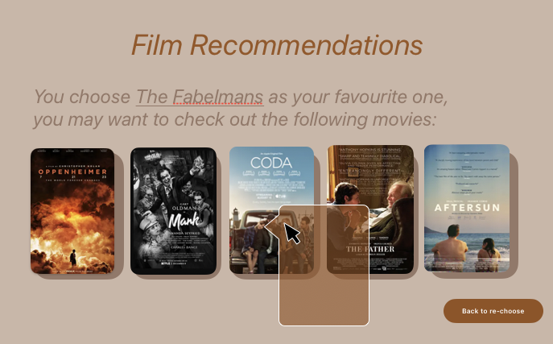
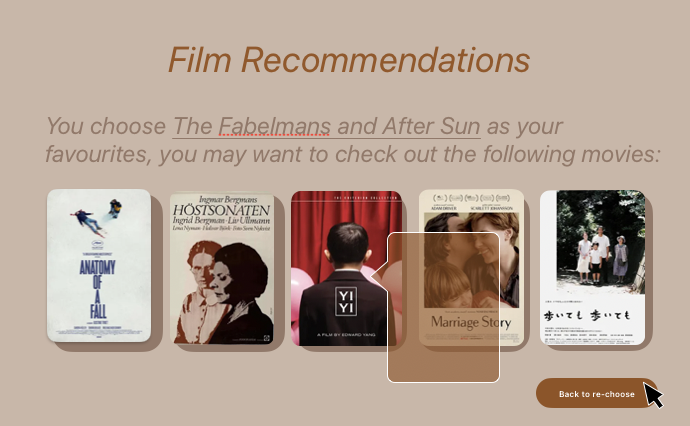

#### Film Event Articles

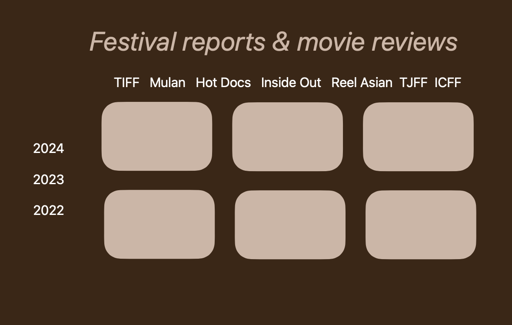

#### Register Page

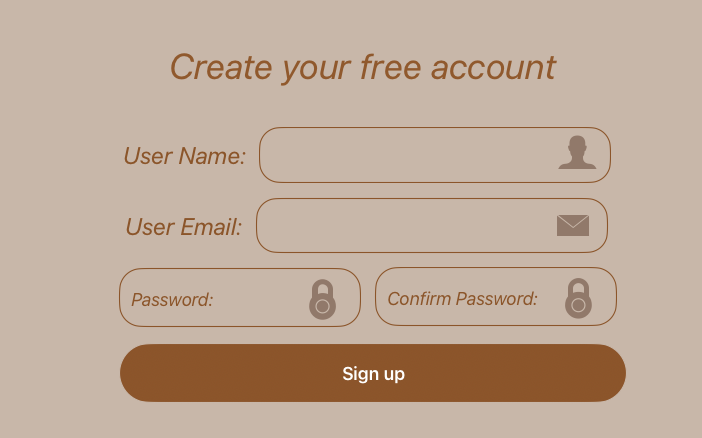

#### Login Page

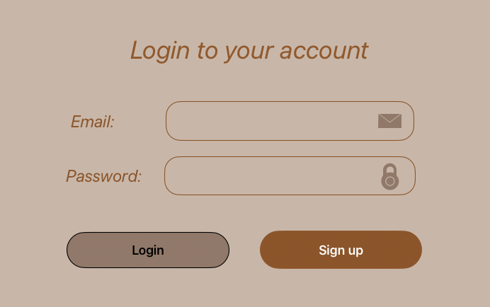

#### Account Dashboard Page

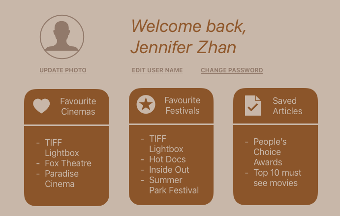

### Data

#### Account Dashboard Page

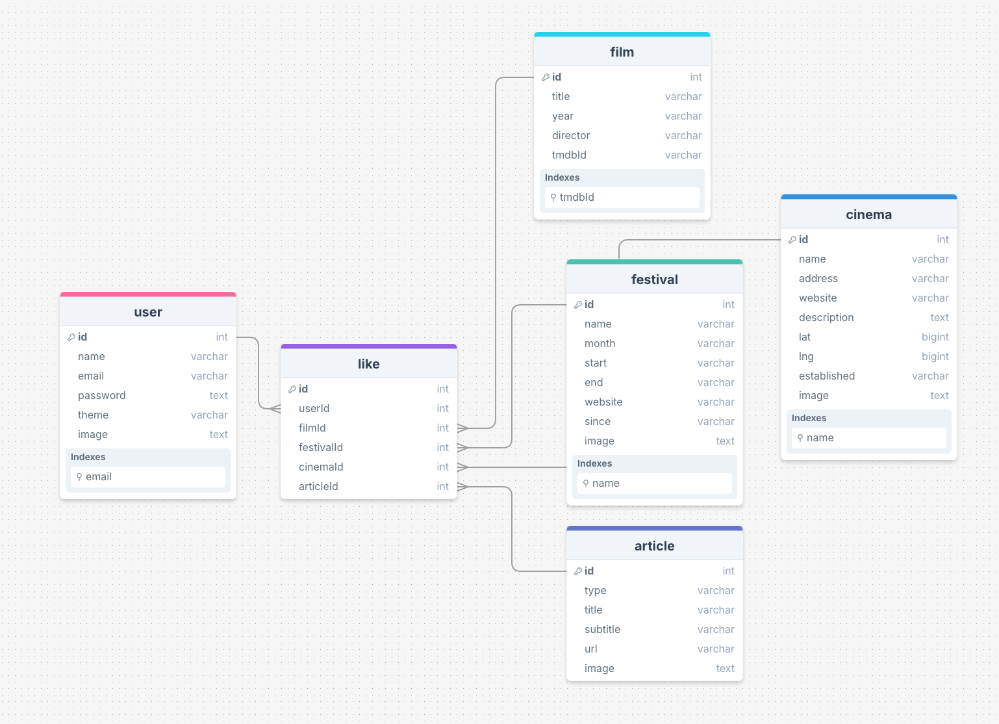

### Endpoints

**GET / cinemas**

- Get cinemas

Parameters (Optional):

- longitude: User-provided location as a number
- latitude: User-provided location as a number

Response:

```json
[
    {
        "id": uuid(),
        "name": "TIFF Lightbox",
        "address": "350 King St W, Toronto, ON M5V 3X5",
        "website": "tiff.net",
        "longitude":""
        "latitude":"",
        "image":"url",
        "likes":2,
        "comment":{[...]}
    },
    ...
]
```

**GET / festivals**

- Get festivals

Response:

```json
[
  {
    "id": uuid(),
    "name": "Toronto International Film Festival",
    "date": "Sep 5 - 15, 2024",
    "location":"TIFF Lightbox",
    "website": "tiff.net",
    "image":"url",
    "likes":2,
    "comment":{[...]}
  },
  ...
]

```

**GET /users**
**GET /users/:userId**

- Get all users or a specific user.
- Logged in user can make like(save) cinemas/festivals/articles

Parameters:

- userId: user's id

Response:

```json
[
    {
        "user_id": uuid(),
        "user_name": "Jennifer",
        "user_email":"Jennifer.2015@gmail.com",
        "user_password":"ASf_3soi*2sad]]a[sfp,fn]",
        "liked": {
            "cinemas": [{...}],
            "articles": [{...}],
            "festivals": [{...}],
        }
    },
    ...
]
```

**GET /articles**

- Get all articles

Response:

```json
[
    {
        "id": uuid(),
        "url": "url"
        "content": "..."
    },
    ...
]
```

**PUT /like/:commentableType/:commentableId**

- put like

Parameters:

- commentableType
- commentableId

Response:

```json
{
    "id": uuid(),
    “likes”: 5,
}
```

**POST /users/register**

- Add a user account

Body:

- email: User's email
- password: User's provided password

Response:

```json
{
  "token": "seyJhbGciOiJIUzI1NiIsInR5cCI6IkpXVCJ9.eyJzdWIiOiIxMjM0NTY3ODkwIiwibmFtZSI6I..."
}
```

**Post /users/login**

- Login a user

Body:

- email: User's email
- password: User's provided password

Response:

```json
{
  "token": "seyJhbGciOiJIUzI1NiIsInR5cCI6IkpXVCJ9.eyJzdWIiOiIxMjM0NTY3ODkwIiwibmFtZSI6I..."
}
```

### Auth

- Next auth

## Roadmap

(Aug 4 Sun - Aug 5 Mon 2-DAYS) - sprint 1

- Create client

  - Next.js and react project with routes and boilerplate pages

- Create server - Create client

  - Next.js project with routing, with placeholder 200 responses

- Set Database & Create Seed

- Gather 10 cinema and 30 festivals in Toronto

- Create seeds with sample data

- Front-end: Home page / Nav / Hero / Footer

- Front-end: Register Page / Login Page / Account Dashboard Page

(Aug 6 Tue - Aug 11 Sun 6 DAYS) - sprint 2

- Front-end: Cinema map / Film Festival Calendar / Film Recommendations / Film Event Articles

- Feature: List cinemas from google map API

  - Use Google API
  - Create GET /cinemas endpoint

- Feature: View festivals

  - Implement view festivals page
  - Create GET /festivals endpoint

- Feature: search film recommendations

  - get film recommendations from Google Gemini

(Aug 12 Mon - Aug 17 Sat 6 DAYS) - sprint 3

- Feature: put likes

  - Add & update likes to festival/cinema/article page
  - Create PUT /likes

- Feature: View articles

  - Implement view festivals page
  - Create GET /articles endpoint

- Feature: Create account

  - Implement register page + form
  - Create POST /users/register endpoint

- Feature: Login

  - Implement login page + form
  - Create POST /users/login endpoint

- Feature: Implement Next Auth
- Deploy client and server projects so all commits will be reflected in production

(Aug 18 Sun - Aug 19 Mon 11:59 PM Mon 2 DAYS) - sprint 4

- Clean up code
- Bug fixes and testing

(Aug 19 Mon 11:59 Mon PM ) - Final submission DAY
(Aug 22 Thur) - DEMO DAY

## Nice-to-haves

- Extend the Cinema Map with more local book and music stores
- Enhance the user experiences to add festivals into their calendar
- Extend the AI film recommendation to show which stream service can watch it
- NextAuth email verification
- Forgot password functionality
- Unit and Integration Tests
