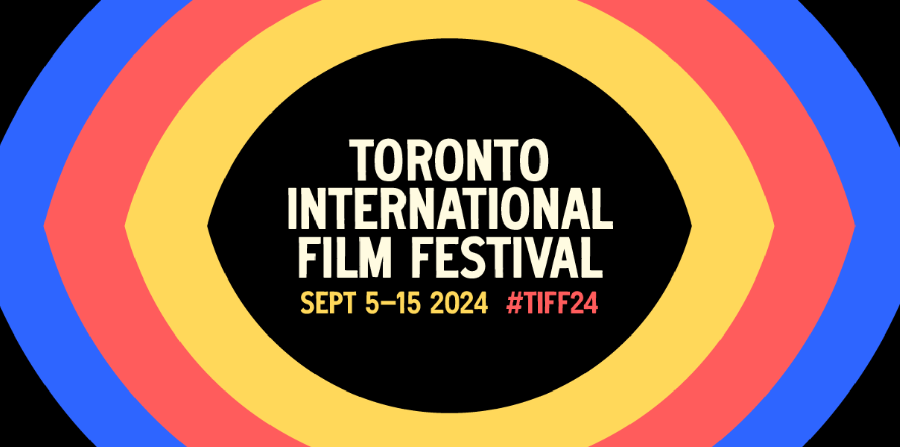

import LanguageToggle from "../../components/article/language-toggle";

<LanguageToggle
  englishContent={(
    

      <h1>Welcome to My Blog</h1>
      
This is the English version of the article.

    

  )}
  chineseContent={(
    <section>
      

        <h1>TIFF 2024 购票指南 🎟️</h1>
        
        <h2>关键日期 🗓️</h2>
        <h3>6月</h3>
        <ul>
          <li>6月12日 Curated 套票预售对TIFF会员开放</li>
          <li>6月19日 Curated 套票预售对Visa卡持有者开放</li>
          <li>6月26日 Curated 套票预售停止</li>
        </ul>
        <h3>8月</h3>
        <ul>
          <li>8月13日 官方排片表公布</li>
          <li>8月16日 电影节单票对Leader级别会员开售</li>
          <li>8月18日 电影节单票及成套购票（一次性购买10张及以上）对 Patron 级别会员开售</li>
          <li>8月19日 10:00am 电影节单票及成套购票（一次性购买10张及以上）对Early Bird Sustainer级别会员开售, 2:00pm 电影节单票及成套购票（一次性购买10张及以上）对普通Sustainer级别会员开售</li>
          <li>8月20日 10:00am 电影节单票及成套购票（一次性购买10张及以上）对 Early Bird Contributor 级别会员开售, 2:00pm 电影节单票及成套购票（一次性购买10张及以上）对普通 Contributor 级别会员开售</li>
          <li>8月21日 电影节单票及成套购票（一次性购买10张及以上）对 Early Bird Individual 及 Industry 级别会员开售</li>
          <li>8月22日 电影节单票及成套购票（一次性购买10张及以上）对普通individual及Industry级别会员开售</li>
          <li>8月23日 电影节Insider预售开始</li>
          <li>8月23日 电影节单票对25岁以下的Free Pass持有者开售</li>
          <li>8月26日 电影节所有电影票对大众开放售卖</li>
        </ul>
        <h3>9月</h3>
        <ul>
          <li>9月5日-15日 第49届多伦多国际电影节举行</li>
        </ul> 
      

      

        <h2>票务类型 🎟️</h2>

        <h3>总体分为三类：</h3>
        <ul>
          <li>Curated Ticket Packages</li>
          <li>Individual Tickets</li>
          <li>Ticket Bundles</li>
        </ul>

         <h3>第一类:</h3>
         
Curated Ticket Packages （类似以前的 TIFF 套票，具体分为 7 种不同的组合，影迷可根据自己的喜好选择适合自己的一种组合。）

          <ul>
            <li>I. Buzz List $1730 可以选择 5 部对热门的电影</li>
            <li>II. Opening Night $135 可以观看本届电影节的开幕影片，并选择最好的位置</li>
            <li>III. Closing Night $115 可以观看本届电影节的闭幕影片，并选择最好的位置</li>
            <li>IV. Midnight Madness Premiere Pass $360 可以观看全部公10部午夜惊奇单元（Midnight Madness）的首映场电影</li>
            <li>V. In Conversation With...All Access Pass $300 可以参加全部共 4/5 场与名人对话活动（In Conversation With）</li>
            <li>VI. Gala Presentations Package $176 可以观看 9月10日-13日 的全景展映单元（Gala Presentations）的世界首映场电影场次</li>
            <li>VII. People‘s Choice Award Screening $28 可以观看电影节最后的大奖人民选择奖（People‘s Choice Award）的获奖电影</li>
          </ul>
          <h3>第二类:Individual Tickets 单票</h3>
          
每场电影的单票将于8月16日根据会员级别对TIFF会员开放售卖，于8月26日对大众开放售卖。

          
          <h3>第三类:Ticket Bundles 套票</h3>
          
该组合为一次性购买10张及以上非首映场次的电影票。按这个组合购买会比分开单买10张及以上票节省20% 

      

    </section>
  )}
/>

